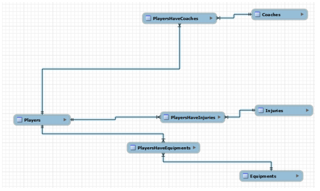
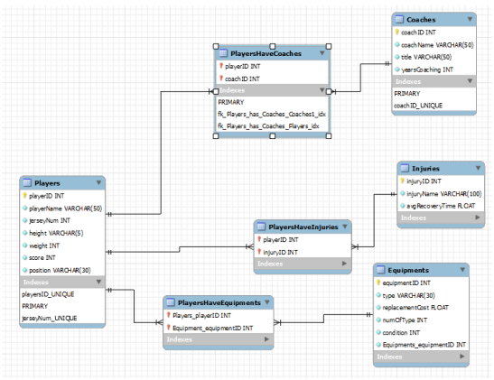
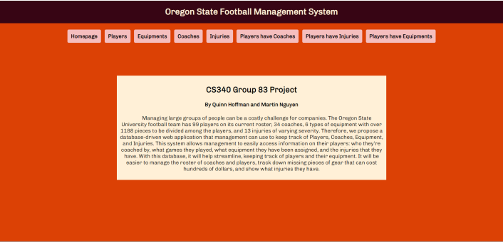
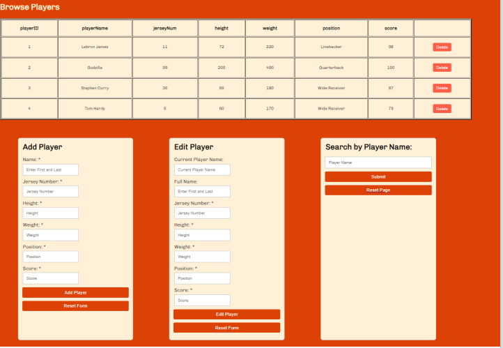
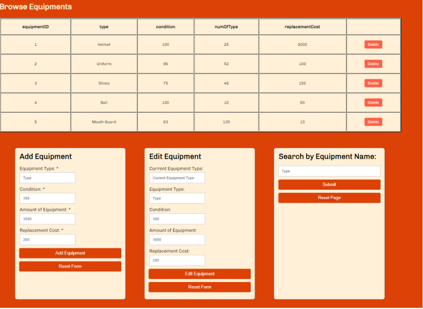
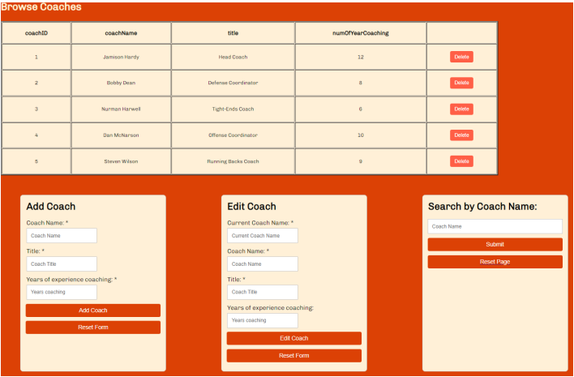
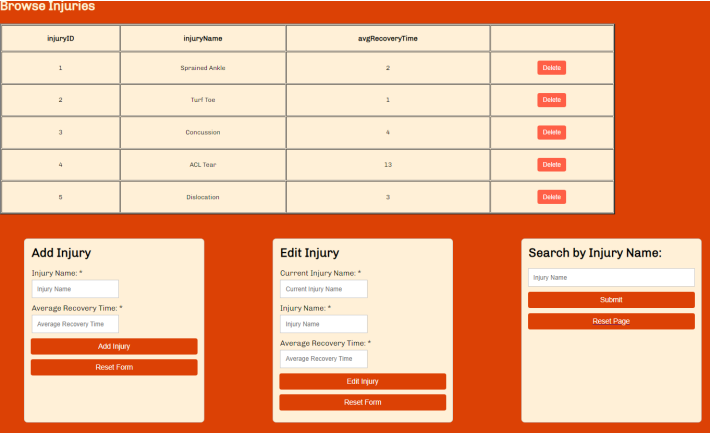
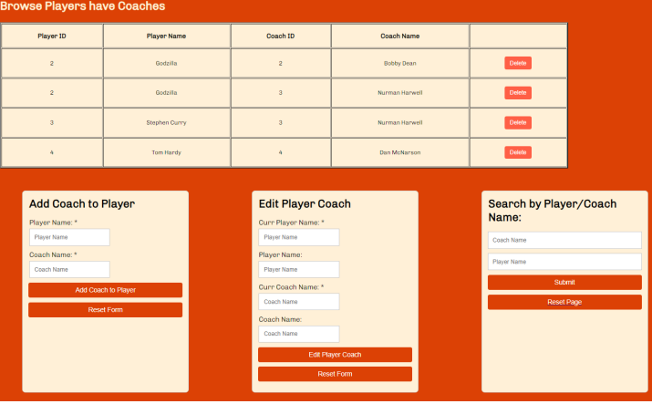
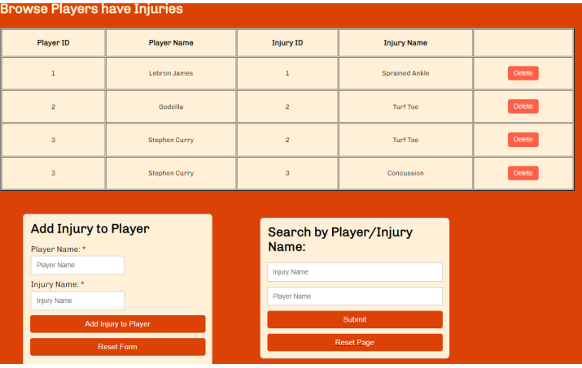
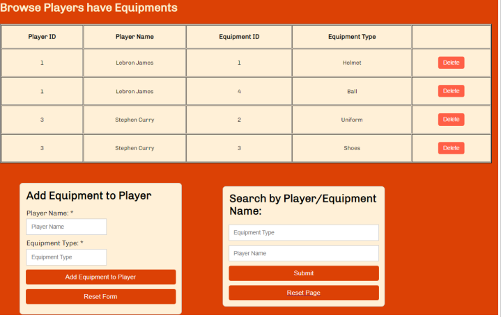

# Team Management Database ProjecT

Project created by Quinn Hoffman and Martin Nguyen as the final project for the CS340 Introduction to Database course for Winter 2024.

## Overview

  Managing the OSU football team's 99 players, 34 coaches, 1188 pieces of equipment, and 13 injuries is challenging. Our database-driven web application allows management to track Players, Coaches, Equipment, and Injuries efficiently. This system streamlines data access, helps manage the roster, tracks gear, and monitors injuries.

### Technologies Used
- JavaScript
- HTML
- CSS
- SQL

## Database Outline

### Players

Records the details of players within the team:
- `playerID`: int, unique, not NULL, PK, auto_increment
- `playerName`: varChar(50), not NULL
- `jerseyNum`: int, unique, not NULL
- `height`: int, not NULL
- `weight`: int, not NULL
- `position`: varChar(30), not NULL
- `score`: int(100), not NULL
- Relationships:
  - M:M with Coaches with `coachID` and `playerID` as foreign keys inside of the intersection table `PlayersHaveCoaches`
  - 1:M with `PlayersHaveEquipments` with `playersID` as an FK inside of `PlayersHaveEquipments`
  - M:M with Injuries with `injuryID` and `playerID` as FKs inside intersection table `PlayersHaveInjuries`

### Coaches

Records the details of coaches within the team:
- `coachID`: int, unique, not NULL, PK, auto_increment
- `coachName`: varChar(50), not NULL
- `title`: varChar(50), not NULL
- `yearsCoaching`: int, not NULL
- Relationships:
  - M:M with Players with `coachID` and `playerID` as foreign keys inside of the intersection table `PlayersHaveCoaches`

### PlayersHaveCoaches

Intersection table between Players and Coaches:
- `playerID`, FK
- `coachID`, FK
- Relationships:
  - 1:M with Players with `playerID` as an FK inside of `PlayersHaveCoaches`
  - M:1 with Coaches with `coachID` as an FK inside of `PlayersHaveCoaches`

### Equipments

Records details of each piece of equipment associated with a player:
- `equipmentID`: int, unique, not NULL, PK, auto_increment
- `type`: varChar(30), not NULL
- `numOfType`: int, not NULL
- `replacementCost`: float, not NULL
- `condition`: int, not NULL
- Relationships:
  - 1:M with `PlayersHaveEquipments` with `equipmentID` as an FK inside of `PlayersHaveEquipments`

### PlayersHaveEquipments

Intersection table between Players and Equipments:
- `playerID`, FK
- `equipmentID`, FK
- Relationships:
  - 1:M with Players with `playerID` as an FK inside `PlayersHaveEquipments`
  - 1:M with Equipments with `equipmentID` as an FK inside `PlayersHaveEquipments`

### Injuries

Records injuries sustained by each player:
- `injuryID`: int, PK, unique, auto_increment
- `injuryName`: varChar(100)
- `avgRecoveryTime`: float, not NULL
- Relationships:
  - M:M with Players with `injuryID` and `playerID` as FKs inside intersection table `PlayersHaveInjuries`

### PlayersHaveInjuries

Intersection table between Players and Injuries:
- `playerID`, FK
- `injuryID`, FK
- Relationships:
  - 1:M with Players with `playerID` as an FK inside `PlayersHaveInjuries`
  - 1:M with Injuries with `injuryID` as an FK inside `PlayersHaveInjuries`

## ER Diagram

## Schema

## Example Data

### Players

| playerID | playerName    | jerseyNum | height | weight | score | position   |
|----------|---------------|-----------|--------|--------|-------|------------|
| 1        | Lebron James  | 11        | 72     | 220    | 98    | Linebacker |
| 2        | Godzilla      | 99        | 200    | 400    | 100   | Quarterback|
| 3        | Stephen Curry | 30        | 66     | 180    | 87    | Wide Receiver|
| 4        | Tom Hardy     | 6         | 60     | 170    | 79    | Wide Receiver|

### Coaches

| coachID | coachName     | title               | yearsCoaching |
|---------|---------------|---------------------|---------------|
| 1       | Jamison Hardy | Head Coach          | 12            |
| 2       | Bobby Dean    | Defense Coordinator | 8             |
| 3       | Nurman Harwell| Tight-Ends Coach    | 6             |
| 4       | Dan McNarson  | Offensive Coordinator| 10            |
| 5       | Steven Wilson | Running Backs Coach | 9             |

### PlayersHaveCoaches

| playerID | coachID |
|----------|---------|
| 1        | 1       |
| 2        | 2       |
| 2        | 3       |
| 3        | 3       |
| 4        | 4       |

### Injuries

| injuryID | injuryName    | avgRecoveryTime |
|----------|---------------|-----------------|
| 1        | Sprained Ankle| 2               |
| 2        | Turf Toe      | 1               |
| 3        | Concussion    | 4               |
| 4        | ACL tear      | 13              |
| 5        | Dislocation   | 3               |

### PlayersHaveInjuries

| playerID | injuryID |
|----------|----------|
| 1        | 1        |
| 1        | 4        |
| 2        | 2        |
| 3        | 2        |
| 3        | 3        |

### Equipments

| equipmentID | type        | numOfType | replacementCost | condition |
|-------------|-------------|-----------|-----------------|-----------|
| 1           | Helmet      | 25        | 2000            | 100       |
| 2           | Uniform     | 52        | 100             | 95        |
| 3           | Shoes       | 45        | 150             | 75        |
| 4           | Ball        | 10        | 50              | 100       |
| 5           | Mouth Guard | 130       | 10              | 83        |

### PlayersHaveEquipments

| playerID | equipmentID |
|----------|-------------|
| 1        | 1           |
| 2        | 2           |
| 2        | 3           |
| 3        | 3           |
| 4        | 4           |

## Screenshots of UI

### Index Page

### Players Page

### Equipments Page

### Coaches Page

### Injuries Page

### PlayersHaveCoaches Page

### PlayersHaveInjuries Page

### PlayersHaveEquipments Page

